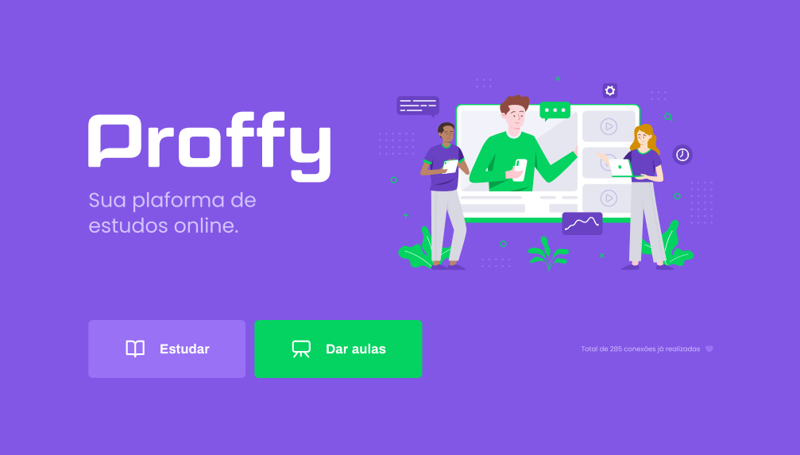

   

> :rocket: Projeto feito para conectar professores e estudantes, feito na Next Level Week #2 @Rocketseat

# :pushpin: Tabela de Conteúdo

* [Tecnologias](#computer-tecnologias)
* [Funcionalidades](#rocket-funcionalidades)
* [Como rodar](#construction_worker-como-rodar)
* [Encontrou um bug? Ou está faltando uma feature?](#bug-problemas)
* [Contribuindo](#tada-contribuindo)

<h2 align="left"> 📥 Layout disponivel para download em: </h2>

### Web Screenshot

   
   

### Mobile Screenshot

   
   
   
   

